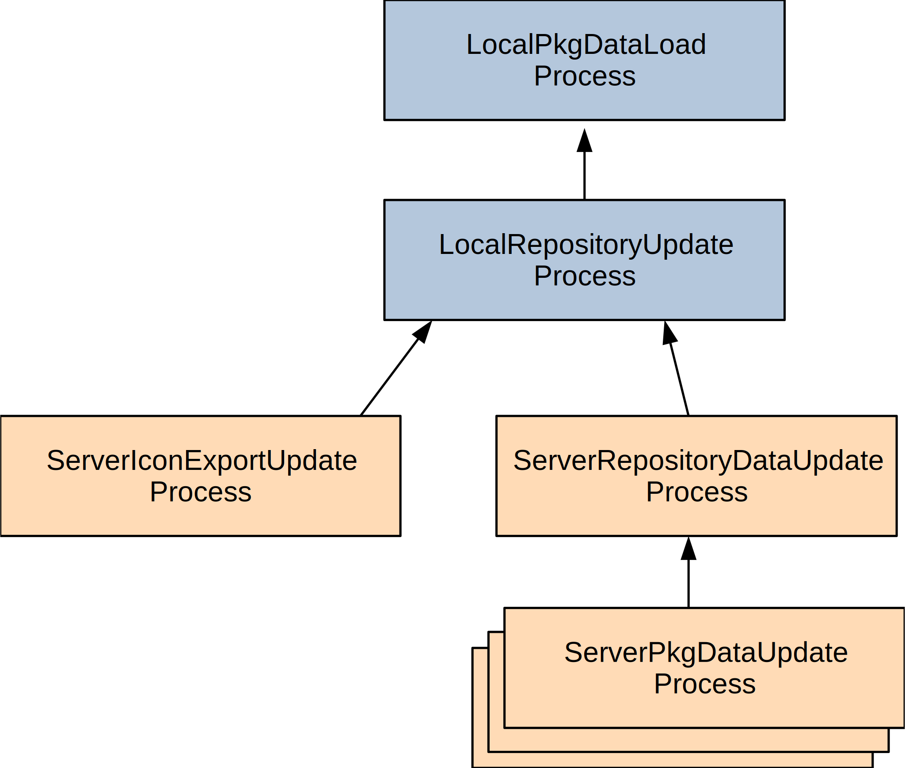
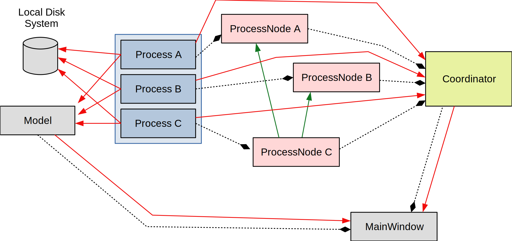

HaikuDepot and Server Interactions
==================================

Introduction
------------

This document aims to outline the general approach taken within the
HaikuDepot application with regard to coordinating processes that relate
to fetching and consuming data from remote systems.

There are two main sources of remote data that are downloaded and
consumed from network sources into the HaikuDepot desktop application;

-  Repository HPKR data from a Haiku mirror such as “HaikuPorts”
-  Meta-data related to packages from
   `HaikuDepotServer <http://depot.haiku-os.org>`__ (HDS) such as icons,
   localizations, ratings and so on.

Process, ProcessNode and Coordinator
------------------------------------

A *Process* (root class ``AbstractProcess``) is a class that takes
responsibility for some aspect of pulling material down from a network
source and processing it.

A *ProcessNode* is a holder for a Process, but also takes responsibility
for the following;

-  Maintaining the relationship between the Processes. For example, if
   Process A needs to complete before Process B then the ProcessNode
   would record this fact. It does this by storing *predecessor* and
   *successor* ProcessNodes.
-  Starting the held Process in a newly spawned thread.
-  Stopping the held Process.

A *Coordinator* holds a list of ProcessNodes. It will start, stop and
cancel nodes as necessary such that, in an ideal case, the various
ProcessNodes are completed in the correct order.

The *ProcessCoordinatorFactory* is able to create Coordinators.

Bulk Load Processes
-------------------

The following diagram shows the logical dependencies of the various
Processes that are involved in refreshing the HPKR data from remote
repositories and then loading data from the HDS system.

   Process Dependencies

For example, the ``ServerRepositoryDataUpdateProcess`` must wait until
the ``LocalRepositoryUpdateProcess`` has completed before it is able to
be started. It is the reponsibility of the Coordinator to ensure that
this sequencing is enforced. There are many instances of
``ServerPkgDataUpdateProcess`` shown because there will be one launched
for each of the Repositories for which data will be downloaded;
“HaikuDepot” etc…

Process / ProcessNode / Coordinator
-----------------------------------

The following diagram shows the relationship and interplay between the
various objects that are involved in running a larger task. Only
fictional Processes are shown to keep the diagram tidy. See above for
the actual Processes.

   Process Relationship and Interplay

Dotted lines show associations between elements and red lines show
interaction or data-flow. Green arrows here demonstratively show some
dependency; Process C cannot start until A and B are completed.

The MainWindow owns the Coordinator for the life-span of undertaking
some larger task.

Each Process is coupled with a ProcessNode and then the Coordinator has
a list of the ProcessNodes-s. The Processes are generally writing to the
local disk system (often with compressed files) to cache data (see
``~/config/cache/HaikuDepot``) and also relay data into the ``Model``
object that maintains state for the HaikuDepot desktop application.

The Processes communicate when they have finished to the Coordinator and
it is at these events that the Coordinator is able to introspect the
state of the Processes in order to know what to do next.

The Coordinator also communicates with MainWindow. It communicates with
the MainWindow in order to signal changes or progress in the overall
larger task. The MainWindow also uses these events to discover when the
Coordinator has completely finished.

Failure
-------

A Process may fail or be stopped. If a Process fails or is stopped then
successor Processes, or those that would have run after the failed
process, are stopped so that they will not run.

The Coordinator will still try to complete any other Processes that
could still run or are running already.

Upon the Coordinator completing, the Coordinator will signal to the
MainWindow client the change in state and then the MainWindow will be
able to identify that the Coordinator has completed, but that something
has gone wrong along the way.

Concurrency
-----------

It is important to note that Processes may run concurrently. The
Processes’ are modelled by the Coordinator as a list rather than a tree.
The dependencies are likely to form a tree or web of Processes that
dictates the order of execution, but it is also quite possible to have
multiple non-intersecting trees or webs such that Processes will execute
independently.
