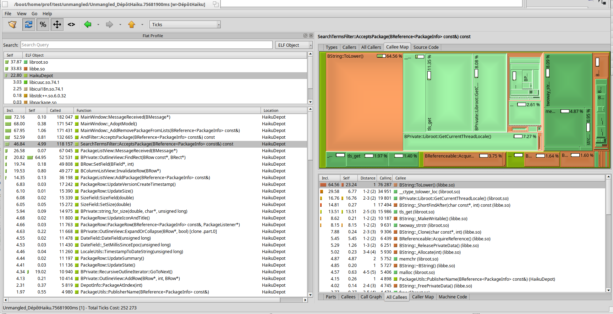
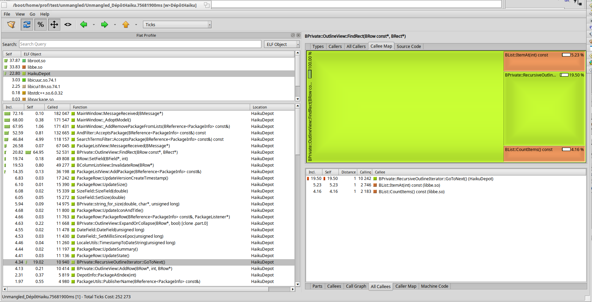

Profiling and optimizing applications
#####################################

This article present how to use tools available under Haiku to analyze performance of Haiku applications in order to Optimize them.

Tools used in this tutorial :

- profile
- c++filt
- QCachegrind

The first two comes with Haiku.
The latest need to be installed using HaikuDepot (GUI) or pkgman (command line).

Overview of the process
=======================

This is basically a three steps process:

- identify a scenario that appears to be slow
- measure the performance using profile
- analyze results using QCachegrind

Measure
-------

profile is a `sample-based profiler<https://nikhilism.com/post/2018/sampling-profiler-internals-introduction/>`_: this tool stops the measured process at regular intervals, and looks at the call stack at this point. The more you stop in a specified function, the more likely this function eats CPU.

All data is consolidated and written in the output directory.

::

    profile -v [output directory] -i [tick interval in ms] [process to start]

The -v option generates data in a format suitable for QCachegrind that we will use later.

Example:

::

    profile -v output_dir -i 300 HaikuDepot

This example generates one file per thread. Depending on what you are looking for, you might prefer to have everything in one file. You can do this using the -S option:

::

    profile -v output_dir -i 300 -S HaikuDepot

Then, you should replay your test case in the launched application. When you close it, measures are written in output directory specified with the -v option.

More options in profile are available. See profile --help

Tips
----

Haiku is mainly written in C++. Function names in C++ binaries are encoded using a specific scheme. This process is called `mangling<https://en.wikipedia.org/wiki/Name_mangling>`_.
In order to have more readable functions name in the analysis, you can use C++filt to pre-process result’s files.

::

    c++filt < [measureFile] > [resultFile]

example :

::

    c++filt < measure_file > unmangled_measure_file

Analyze
-------

Finally, you should start QCachegrind. From there, open the unmangled_measure_file that you have generated at the previous step.

Here, the SearchTermsFilter::AcceptsPackage is hit in 46 % of the samples (first column on the left). If you look on the right view, the callee map shows all functions called from AcceptsPackage with a proportional area. Graphically, we see that ToLower is hit almost 65 % of the time.

The result of this analysis is that you should look at this part of the code to identify a way to optimize this path.

This view shows another frequent case: the OutlineView::FindRect function has a large Self %: almost 65 % (large green rectangle). This pinpoints the fact that most of the time, we stop in the function itself, not in a subfunction. Maybe, there is something to investigate in the implementation of this function. Or maybe this function is called too often.
