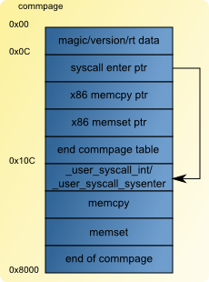

System calls
============

This paper presents the implementation of system calls in haiku, and especially on x86 systems.
The system call mechanism is what allows user land code to communicate with kernel land code.

The whole paper is focused on the example of one system call: is_computer_on. This api tells if the
computer is currently powered on or not. Using this system call as a study is interesting because
its implementation is quite simple, and it is a historical one in BeOS system (with its brother
is_computer_on_fire, but it is not a system call in haiku :). However all elements presented here
remain valid for any other system call.

Execution flow
--------------

Let's start with an otherview of the global process invloved. Here is the whole excecution flow:

.. image:: syscall_bt.png
   :alt: syscall backtrace

When some code calls "is_computer_on", it will call this function from libroot. For this particular
case, a direct call to the internal syscall api is done, that is calling _kern_is_computer_on. So
in this case the only aim of "is_computer_on" is to be a public api to the system call. On other
cases more things may be done before the "_kern_" call. All syscall functions name in user space
begin with the "_kern_" prefix. "_kern_is_computer_on" is just a jump to a fixed location in the
process address space called "commpage".

There can be different code living in the commpage. Depending on the cpu capabilities, either
_user_syscall_sysenter or _user_syscall_int code is present at the same address. These two
functions contain the few instructions needed to transfer execution context to the kernel.

After that the kernel code is executed. Depending on the cpu capabilities, either "x86_sysenter" or
"trap99" will be called. Finally "handle_syscall" calls the handler corresponding to the syscall
number via a callback located in the syscall table. In our example it is "_user_is_computer_on"
whose huge code is:

.. code-block:: cpp

    static inline int
    _user_is_computer_on(void)
    {
        return 1;
    }

No let's see more in details each of these steps, by following the execution path.

Userland
--------

libroot.so
..........

Starting in userland, libroot is where everything is done: All internal ("_kern_xxx") APIs are
located in it. However there is no source code for these functions. They are generated at
compilation time by `gensyscalls <https://cgit.haiku-os.org/haiku/tree/src/tools/gensyscalls>`_ that
is built as part of the Haiku compilation process. Gensyscalls uses the `private syscalls.h header file <https://cgit.haiku-os.org/haiku/tree/headers/private/system/syscalls.h>`_
to generate a source assembly file containing all "_kern_xxx" definitions.
The order of the function definitions in "syscalls.h" determine their syscall number. The generated
assembly source is located at "generated/objects/haiku/x86/common/system/libroot/os/syscalls.S.inc".
Here is what it looks like:

.. code-block:: cpp

    SYSCALL0(_kern_is_computer_on, 0)
    SYSCALL4(_kern_generic_syscall, 1)
    SYSCALL2(_kern_getrlimit, 2)
    ...

SYSCALLX are macros. The number after SYSCALL tells how many arguments are used in the system call.
The two parameters of the macros are the function name, and the syscall number. The SYSCALLX macros
are defined in `syscalls.inc <https://cgit.haiku-os.org/haiku/tree/src/system/libroot/os/arch/x86/syscalls.inc>`_. They contain code that sets the syscall number in eax,
and jump to a fix location in the commpage.

The commpage
............

The commpage is some pages of code that are mapped by the kernel in each loaded process at a fixed
memory location. On the ia32 architecture, this address is 0xffff0000. The first part of this area
is a pointer table of each function it contains. The second part of it is the actual code of the
functions. This allows the kernel to let a process run optimized/specific code for the cpu in
userland.

The syscall entry is the first of the commpage, so its offset is at 0xC from the start of the
commpage. The content of the syscall function is filled in `x86_initialize_syscall in syscalls.cpp <https://cgit.haiku-os.org/haiku/tree/src/system/kernel/arch/x86/32/syscalls.cpp>`_. This is where the cpu capabilites are checked (for the syscall
feature). Depending on them, either trap or sysenter mechanism is used. So depending on this, the
code of "_user_syscall_int" or "_user_syscall_sysenter" is copied in the commpage. The definition
of these two functions is in `syscalls_asm.S <https://cgit.haiku-os.org/haiku/tree/src/system/kernel/arch/x86/32/syscalls_asm.S>`_. The next figure shows the mapping of the commpage area:

In the kernel
-------------

system call handler
...................

Just as there can be 2 codes in commpage to use a syscall, 2 handlers exist to trap them.
"x86_sysenter" and "trap99" are both defined in `interrupts.S <https://cgit.haiku-os.org/haiku/tree/src/system/kernel/arch/x86/32/interrupts.S>`_. However both
functions are always present in the kernel. This means that on a cpu that supports sysenter,
calling syscalls with int99 is still working. Both functions set the cpu/system in the correct
state before calling "handle_syscall".

handle_syscall
..............

This function is the last one before the specific code of each syscall. It is also defined in
"arch_interrupts.S". What it does is copy the syscall parameters to the correct place, and call the
final handler. All these information are retrieved from the "syscall_info" structure defined in
`ksyscalls.h <https://cgit.haiku-os.org/haiku/tree/headers/private/kernel/ksyscalls.h>`_

.. code-block:: cpp

    typedef struct syscall_info {
        void    *function;      // pointer to the syscall function
        int     parameter_size; // summed up parameter size
    } syscall_info;

The array object "kSyscallInfos" contains all definitions for all system calls of the system. The
index in the array is the number of the system call. This object is also generated by gensyscall
in "objects/haiku/x86/common/system/kernel/syscall_table.h". It typically looks like this:

.. code-block:: cpp

    #define SYSCALL_COUNT 247

    #ifndef _ASSEMBLER

    const int kSyscallCount = SYSCALL_COUNT

    const syscal_info kSyscallInfos[] = {
        { (void *)_user_is_computer_on, 0},
        { (void *)_user_generic_syscall, 16},
        { (void *)_user_getrlimit, 8},
        ...

The first define is used by "handle_syscall" to check that the provided syscall number is correct.

Adding syscalls
---------------

So now that all parts are explained, let's see the process of adding a new syscall.
The steps to add a syscall are:

- Add the syscall prototype to `syscalls.h <https://cgit.haiku-os.org/haiku/tree/headers/private/system/syscalls.h>`_. Name it _kern_(). Avoid adding unnecessary
  dependencies to the header. I.e. if your syscall has pointers to structs as arguments, there's no
  need to include the headers that define the structs.
- Add a function prototype _user_() with the same signature as your syscall to a fitting kernel
  header under "headers/private/kernel/".
- Make sure the header with the _user_() prototype is included by `syscalls.cpp <https://cgit.haiku-os.org/haiku/tree/src/system/kernel/syscalls.cpp>`_.
- Implement _user_() in a fitting source file.

That's it. There are some general rules for the implementation of a syscall:

- If your syscall has a 64 bit return value (as opposed to the common 32 bit status_t/ssize_t/int
  etc.), call syscall_64_bit_return_value() at the very beginning.
- Never access user memory directly or IOW, if your syscall has a parameter that is a pointer to
  something, never dereference the pointer. Also don't dereference pointers in structures you get
  from userland. If you have to access user data, first check that the pointer actually points to
  user address space, using the IS_USER_ADDRESS() macro (if not, fail with B_BAD_ADDRESS). Allocate
  kernel memory large enough to hold the user data. If it's a small structure or short string, use
  the stack, otherwise allocate on the heap. For variable sized data enforce maximum limits. Then
  copy the user data to your kernel memory using user_memcpy(). Parameters are the same as for
  memcpy(), but the return value is a status_t. If it's not B_OK, fail with B_BAD_ADDRESS. If you
  want to return a data structure to userland, use the same strategy (just with swapped parameters
  for user_memcpy(), of course).
- If your syscall can block and can be interrupted, make it restartable (there are exceptions when
  that is not necessary/desired, but usually it is). Restartable means that if your syscall has be
  interrupted by a signal, the kernel can just invoke it again after the signal has been handled.
  It will get the exact same parameters, which in some cases requires some special handling. E.g.
  relative timeouts have to be converted to absolute ones and stored. There are inline functions in
  `syscall_restart.h <https://cgit.haiku-os.org/haiku/tree/headers/private/kernel/syscall_restart.h>` which help with that. If you don't have any problematic parameters,
  just invoke syscall_restart_handle_post() with B_INTERRUPTED before you return from the syscall,
  if the syscall has been interrupted. Most syscalls return error codes and the function returns
  the error code passed to it, so one can use it like "return syscall_restart_handle_post(error);".
  If you have to deal with relative timeouts, use the appropriate syscall_restart_handle_timeout_pre()
  function at the beginning and syscall_restart_handle_timeout_post() (instead of
  restart_handle_post()) at the end of the syscall. The latter stores the timeout for restart, the
  former converts the timeout to absolute, respectively restores the stored timeout on syscall
  restart.

Hello world
-----------

Let's finish this article with something I cannot resist to add here: An assembler hello world
example using the write syscall. This is something that was already published a long time ago on
<a href="http://asm.sourceforge.net/intro/hello.html#AEN159" rel="nofollow">linux assembly</a>.
However this was for BeOS, and the syscall interface of haiku is not the same. We will use "int 99"
to do the syscalls so that it works on all x86 systems. Looking in the generated "syscalls.S.inc"
we can see that "write" is syscall number 131 and "exit" is syscall number 33. So here is the code:

.. code-block:: asm

  section .text
   global _start

  _syscall:		; system call
      int 99
      ret

  _start:			; entry point for the linker
      push  dword len	; message length
      push  dword msg	; message to print
      push  dword  0	; 0 = offset (64 bits)
      push  dword  0	; 0 = offset (64 bits)
      push  dword  1	; 1 = stdout
      mov   eax, 131	; write syscall
      call  _syscall
      add   esp,20	; restore stack

      push  dword  0	; exit code
      mov   eax, 33	; exit syscall
      call  _syscall

  section .data

  msg   db    "Hello world from Haiku syscall!",0xa
  len   equ   $ - msg

Yasm can be used to compile it, and ld to link it:

.. code-block:: sh

 yasm -f elf hello.asm
 ld -s -o hello hello.o
 ./hello
 Hello world from Haiku syscall!

Conclusion
----------

This was just a brief description of how system calls are processed. However it should help to see
the global picture of this part of the Haiku system. There would be a lot of other things to tell
around this subject, especially on the ia32 specific code, but this would go beyond the aim of this
introduction paper.
