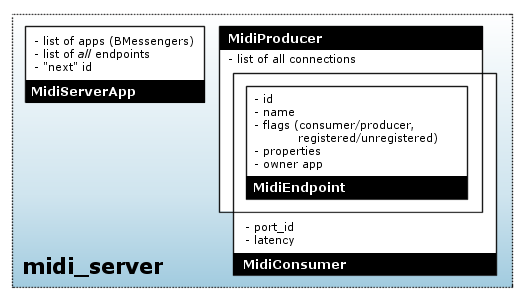
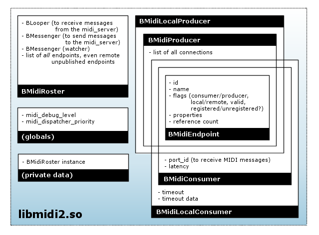

Midi Kit design
===============

The Midi Kit consists of the midi_server and two shared libraries,
libmidi2.so and libmidi.so. The latter is the "old" pre-R5 Midi Kit and
has been re-implemented using the facilities from libmidi2, which makes
it fully compatible with the new kit. This document describes the design
and implementation of the OpenBeOS midi_server and libmidi2.so.

The midi_server has two jobs: it keeps track of the endpoints that the
client apps have created, and it publishes endpoints for the devices
from /dev/midi. (This last task could have been done by any other app,
but it was just as convenient to make the midi_server do that.) The
libmidi2.so library also has two jobs: it assists the midi_server with
the housekeeping stuff, and it allows endpoints to send and receive MIDI
events. (That's right, the midi_server has nothing to do with the actual
MIDI data.)

--------------

Ooh, pictures
-------------

The following image shows the center of Midi Kit activity, the
midi_server, and its data structures:

   |image0|

And here is the picture for libmidi2.so:

   |image1|

Note that these diagrams give only a conceptual overview of who is
responsible for which bits of data. The actual implementation details of
the kit may differ.

--------------

Housekeeping
------------

-  The design for our implementation of the midi2 "housekeeping"
   protocol roughly follows `what Be did <oldprotocol.html>`__, although
   there are some differences. In Be's implementation, the BMidiRosters
   only have BMidiEndpoints for remote endpoints if they are registered.
   In our implementation, the BMidiRosters have BMidiEndpoint objects
   for *all* endpoints, including remote endpoints that aren't published
   at all. If there are many unpublished endpoints in the system, our
   approach is less optimal. However, it made the implementation of the
   Midi Kit much easier ;-)

-  Be's libmidi2.so exports the symbols "midi_debug_level" and
   "midi_dispatcher_priority", both int32's. Our libmidi2 does not use
   either of these. But even though these symbols are not present in the
   headers, some apps may use them nonetheless. That's why our libmidi2
   exports those symbols as well.

-  The name of the message fields in Be's implementation of the protocol
   had the "be:" prefix. Our fields have a "midi:" prefix instead.
   Except for the fields in the B_MIDI_EVENT notification messages,
   because that would break compatibility with existing apps.

Initialization
~~~~~~~~~~~~~~

-  The first time an app uses a midi2 class, the
   BMidiRoster::MidiRoster() method sends an 'Mapp' message to the
   midi_server, and blocks (on a semaphore). This message includes a
   messenger to the app's BMidiRosterLooper object. The server adds the
   app to its list of registered apps. Then the server asynchronously
   sends back a series of 'mNEW' message notifications for all endpoints
   on the roster, and 'mCON' messages for all existing connections. The
   BMidiRosterLooper creates BMidiEndpoint objects for these endpoints
   and adds them to its local roster; if the app is watching, it also
   sends out corresponding B_MIDI_EVENT notifications. Finally, the
   midi_server sends an 'mAPP' message to notify the app that it has
   been successfully registered. Upon receipt, BMidiRoster::MidiRoster()
   unblocks and returns control to the client code. This handshake is
   the only asynchronous message exchange; all the other requests have a
   synchronous reply.

-  If the server detects an error during any of this (incorrect message
   format, delivery failure, etc.) it simply ignores the request and
   does not try to send anything back to the client (which is most
   likely impossible anyway). If the app detects an error (server sends
   back meaningless info, cannot connect to server), it pretends that
   everything is hunkey dorey. (The API has no way of letting the client
   know that the initialization succeeded.) Next time the app tries
   something, the server either still does not respond, or it ignores
   the request (because this app isn't properly registered). However, if
   the app does not receive the 'mAPP' message, it will not unblock, and
   remains frozen for all eternity.

-  BMidiRoster's MidiRoster() method creates the one and only
   BMidiRoster instance on the heap the first time it is called. This
   instance is automatically destroyed when the app quits.

Error handling
~~~~~~~~~~~~~~

-  If some error occurs, then the reply message is only guaranteed to
   contain the "midi:result" field with some non- zero error code.
   libmidi2 can only assume that the reply contains other data on
   success (i.e. when "midi:result" is B_OK).

-  The timeout for delivering and responding to a message is about 2
   seconds. If the client receives no reply within that time, it assumes
   the request failed. If the server cannot deliver a message within 2
   seconds, it assumes the client is dead and removes it (and its
   endpoints) from the roster. Of course, these assumptions may be
   false. If the client wasn't dead and tries to send another request to
   the server, then the server will now ignore it, since the client app
   is no longer registered.

-  Because we work with timeouts, we must be careful to avoid
   misunderstandings between the midi_server and the client app. Both
   sides must recognize the timeout, so they both can ignore the
   operation. If, however, the server thinks that everything went okay,
   but the client flags an error, then the server and the client will
   have two different ideas of the current state of the roster. Of
   course, those situations must be avoided.

-  Although apps register themselves with the midi_server, there is no
   corresponding "unregister" message. The only way the server
   recognizes that an app and its endpoints are no longer available is
   when it fails to deliver a message to that app. In that case, we
   remove the app and all its endpoints from the roster. To do this, the
   server sends "purge endpoint" messages to itself for all of the app's
   endpoints. This means we don't immediately throw the app away, but we
   schedule that for some time in the future. That makes the whole event
   handling mechanism much cleaner. There is no reply to the purge
   request. (Actually, we *do* immediately throw away the app_t object,
   since that doesn't really interfere with anything.) (If there are
   other events pending in the queue which also cause notifications,
   then the server may send multiple purge messages for the same
   endpoints. That's no biggie, because a purge message will be ignored
   if its endpoint no longer exists.)

-  As mentioned above, the midi_server ignores messages that do not come
   from a registered app, although it does send back an error reply. In
   the case of the "purge endpoint" message, the server makes sure the
   message was local (i.e. sent by the midi_server itself).

-  Note: BMessage's SendReply() apparently succeeds even if you kill the
   app that the reply is intended for. This is rather strange, and it
   means that you can't test delivery error handling for replies by
   killing the app. (You *can* kill the app for testing the error
   handling on notifications, however.)

Creating and deleting endpoints
~~~~~~~~~~~~~~~~~~~~~~~~~~~~~~~

-  When client code creates a new BMidiLocalProducer or
   BMidiLocalConsumer endpoint, we send an 'Mnew' message to the server.
   Unlike Be's implementation, the "name" field is always present, even
   if the name is empty. After adding the endpoint to the roster, the
   server sends 'mNEW' notifications to all other applications. Upon
   receipt of this notification, the BMidiRosterLoopers of these apps
   create a new BMidiEndpoint for the endpoint and add it to their
   internal list of endpoints. The app that made the request receives a
   reply with a single "midi:result" field.

-  When you "new" an endpoint, its refcount is 1, even if the creation
   failed. (For example, if the midi_server does not run.) When you
   Acquire(), the refcount is bumped. When you Release(), it is
   decremented. When refcount drops to 0, the endpoint object "deletes"
   itself. (So client code should never use an endpoint after having
   Release()'d it, because the object may have just been killed.) When
   creation succeeds, IsValid() returns true and ID() returns a valid ID
   (> 0). Upon failure, IsValid() is false and ID() returns 0.

-  After the last Release() of a local endpoint, we send 'Mdel' to let
   the midi_server know the endpoint is now deleted. We don't expect a
   reply back. If something goes wrong, the endpoint is deleted
   regardless. We do not send separate "unregistered" notifications,
   because deleting an endpoint implies that it is removed from the
   roster. For the same reason, we also don't send separate
   "disconnected" notifications.

-  The 'mDEL' notification triggers a BMidiRosterLooper to remove the
   corresponding BMidiEndpoint from its internal list. This object is
   always a proxy for a remote endpoint. The remote endpoint is gone,
   but whether we can also delete the proxy depends on its reference
   count. If no one is still using the object, its refcount is zero, and
   we can safely delete the object. Otherwise, we must defer destruction
   until the client Release()'s the object.

-  If you "delete" an endpoint, your app drops into the debugger.

-  If you Release() an endpoint too many times, your app *could* drop
   into the debugger. It might also crash, because you are now using a
   dead object. It depends on whether the memory that was previously
   occupied by your endpoint object was overwritten in the mean time.

-  You are allowed to pass NULL into the constructors of
   BMidiLocalConsumer and BMidiLocalProducer, in which case the
   endpoint's name is simply an empty string.

Changing endpoint attributes
~~~~~~~~~~~~~~~~~~~~~~~~~~~~

-  An endpoint can be "invalid". In the case of a proxy this means that
   the remote endpoint is unregistered or even deleted. Local endpoints
   can only be invalid if something went wrong during their creation (no
   connection to server, for example). You can get the attributes of
   invalid objects, but you cannot set them. Any attempts to do so will
   return an error code.

-  For changing the name, latency, or properties of an endpoint,
   libmidi2 sends an 'Mchg' message with the fields that should be
   changed, "midi:name", "midi:latency", or "midi:properties".
   Registering or unregistering an endpoint also sends such an 'Mchg'
   message, because we consider the "registered" state also an
   attribute, in "midi:registered". The message obviously also includes
   the ID of the endpoint in question. Properties are sent using a
   different message, because the properties are not stored inside the
   BMidiEndpoints.

-  After handling the 'Mchg' request, the midi_server broadcasts an
   'mCHG' notification to all the other apps. This message has the same
   contents as the original request.

-  If the 'Mchg' message contains an invalid "midi:id" (i.e. no such
   endpoint exists or it does not belong to the app that sent the
   request), the midi_server returns an error code, and it does not
   notify the other apps.

-  If you try to Register() an endpoint that is already registered,
   libmidi2 does not send a message to the midi_server but simply
   returns B_OK. (Be's implementation *did* send a message, but our
   libmidi2 also keeps track whether an endpoint is registered or not.)
   Although registering an endpoint more than once doesn't make much
   sense, it is not considered an error. Likewise for Unregister()ing an
   endpoint that is not registered.

-  If you try to Register() or Unregister() a remote endpoint, libmidi2
   immediately returns an error code, and does not send a message to the
   server. Likewise for a local endpoints that are invalid (i.e. whose
   IsValid() function returns false).

-  BMidiRoster::Register() and Unregister() do the same thing as
   BMidiEndpoint::Register() and Unregister(). If you pass NULL into
   these functions, they return B_BAD_VALUE.

-  SetName() ignores NULL names. When you call it on a remote endpoint,
   SetName() does nothing. SetName() does not send a message if the new
   name is the same as the current name.

-  SetLatency() ignores negative values. SetLatency() does not send a
   message if the new latency is the same as the current latency. (Since
   SetLatency() lives in BMidiLocalConsumer, you can never use it on
   remote endpoints.)

-  We store a copy of the endpoint properties in each BMidiEndpoint. The
   properties of new endpoints are empty. GetProperties() copies this
   BMessage into the client's BMessage. GetProperties() returns NULL if
   the message parameter is NULL.

-  SetProperties() returns NULL if the message parameter is NULL. It
   returns an error code if the endpoint is remote or invalid.
   SetProperties() does *not* compare the contents of the new BMessage
   to the old, so it will always send out the change request.

Connections
~~~~~~~~~~~

-  BMidiProducer::Connect() sends an 'Mcon' request to the midi_server.
   This request contains the IDs of the producer and the consumer you
   want to connect. The server sends back a reply with a result code. If
   it is possible to make this connection, the server broadcasts an
   'mCON' notification to all other apps. In one of these apps the
   producer is local, so that app's libmidi2 calls the
   BMidiLocalProducer::Connected() hook.

-  You are not allowed to connect the same producer and consumer more
   than once. The midi_server checks for this. It also returns an error
   code if you try to disconnect two endpoints that were not connected.

-  Disconnect() sends an 'Mdis' request to the server, which contains
   the IDs of the producer and consumer that you want to disconnect. The
   server replies with a result code. If the connection could be broken,
   it also sends an 'mDIS' notification to the other apps. libmidi2
   calls the local producer's BMidiLocalProducer::Disconnected() hook.

-  Connect() and Disconnect() immediately return an error code if you
   pass a NULL argument, or if the producer or consumer is invalid.

-  When you Release() a local consumer that is connected, all apps will
   go through their producers, and throw away this consumer from their
   connection lists. If one of these producers is local, we call its
   Disconnected() hook. If you release a local producer, this is not
   necessary.

Watching
~~~~~~~~

-  When you call StartWatching(), the BMidiRosterLooper remembers the
   BMessenger, and sends it B_MIDI_EVENT notifications for all
   registered remote endpoints, and the current connections between
   them. It does not let you know about local endpoints. When you call
   StartWatching() a second time with the same BMessenger, you'll
   receive the whole bunch of notifications again. StartWatching(NULL)
   is not allowed, and will be ignored (so it is not the same as
   StopWatching()).

Thread safety
~~~~~~~~~~~~~

-  Within libmidi2 there are several possible race conditions, because
   we are dealing with two threads: the one from BMidiRosterLooper and a
   thread from the client app, most likely the BApplication's main
   thread. Both can access the same data: BMidiEndpoint objects. To
   synchronize these threads, we lock the BMidiRosterLooper, which is a
   normal BLooper. Anything happening in BMidiRosterLooper's message
   handlers is safe, because BLoopers are automatically locked when
   handling a message. Any other operations (which run from a different
   thread) must first lock the looper if they access the list of
   endpoints or certain BMidiEndpoint attributes (name, properties,
   etc).

-  What if you obtain a BMidiEndpoint object from FindEndpoint() and at
   the same time the BMidiRosterLooper receives an 'mDEL' request to
   delete that endpoint? FindEndpoint() locks the looper, and bumps the
   endpoint object before giving it to you. Now the looper sees that the
   endpoint's refcount is larger than 0, so it won't delete it (although
   it will remove the endpoint from its internal list). What if you
   Acquire() or Release() a remote endpoint while it is being deleted by
   the looper? That also won't happen, because if you have a pointer to
   that endpoint, its refcount is at least 1 and the looper won't delete
   it.

-  It is not safe to use a BMidiEndpoint and/or the BMidiRoster from
   more than one client thread at a time; if you want to do that, you
   should synchronize access to these objects yourself. The only
   exception is the Spray() functions from BMidiLocalProducer, since
   most producers have a separate thread to spray their MIDI events.
   This is fine, as long as that thread isn't used for anything else,
   and it is the only one that does the spraying.

-  BMidiProducer objects keep a list of consumers they are connected to.
   This list can be accessed by several threads at a time: the client's
   thread, the BMidiRosterLooper thread, and possibly a separate thread
   that is spraying MIDI events. We could have locked the producer using
   BMidiRosterLooper's lock, but that would freeze everything else while
   the producer is spraying events. Conversely, it would freeze all
   producers while the looper is talking to the midi_server. To lock
   with a finer granularity, each BMidiProducer has its own BLocker,
   which is used only to lock the list of connected consumers.

Misc remarks
~~~~~~~~~~~~

-  BMidiEndpoint keeps track of its local/remote state with an "isLocal"
   variable, and whether it is a producer/consumer with "isConsumer". It
   also has an "isRegistered" field to remember whether this endpoint is
   registered or not. Why not lump all these different states together
   into one "flags" bitmask? The reason is that isLocal only makes sense
   to this application, not to others. Also, the values of isLocal and
   isConsumer never change, but isRegistered does. It made more sense
   (and clearer code) to separate them out. Finally, isRegistered does
   not need to be protected by a lock, even though it can be accessed by
   multiple threads at a time. Reading and writing a bool is atomic, so
   this can't get messed up.

The messages
~~~~~~~~~~~~

   ::

      Message: Mapp (MSG_REGISTER_APP)
          BMessenger midi:messenger
      Reply: 
          (no reply)

      Message: mAPP (MSG_APP_REGISTERED)
          (no fields)

      Message: Mnew (MSG_CREATE_ENDPOINT)
          bool     midi:consumer
          bool     midi:registered
          char[]   midi:name
          BMessage midi:properties
          int32    midi:port       (consumer only)
          int64    midi:latency    (consumer only)
      Reply:
          int32    midi:result
          int32    midi:id

      Message: mNEW (MSG_ENPOINT_CREATED)
          int32    midi:id
          bool     midi:consumer
          bool     midi:registered
          char[]   midi:name
          BMessage midi:properties
          int32    midi:port       (consumer only)
          int64    midi:latency    (consumer only)

      Message: Mdel (MSG_DELETE_ENDPOINT)
          int32 midi:id
      Reply: 
          (no reply)

      Message: Mdie (MSG_PURGE_ENDPOINT)
          int32 midi:id
      Reply: 
          (no reply)

      Message: mDEL (MSG_ENDPOINT_DELETED)
          int32 midi:id

      Message: Mchg (MSG_CHANGE_ENDPOINT)
          int32    midi:id
          int32    midi:registered (optional)
          char[]   midi:name       (optional)
          int64    midi:latency    (optional)
          BMessage midi:properties (optional)
      Reply:
          int32 midi:result

      Message: mCHG (MSG_ENDPOINT_CHANGED)
          int32 midi:id
          int32    midi:registered (optional)
          char[]   midi:name       (optional)
          int64    midi:latency    (optional)
          BMessage midi:properties (optional)

--------------

MIDI events
-----------

-  MIDI events are always sent from a BMidiLocalProducer to a
   BMidiLocalConsumer. Proxy endpoint objects have nothing to do with
   this. During its construction, the local consumer creates a kernel
   port. The ID of this port is published, so everyone knows what it is.
   When a producer sprays an event, it creates a message that it sends
   to the ports of all connected consumers.

-  This means that the Midi Kit considers MIDI messages as discrete
   events. Hardware drivers chop the stream of incoming MIDI data into
   separate events that they send out to one or more kernel ports.
   Consumers never have to worry about parsing a stream of MIDI data,
   just about handling a bunch of separate events.

-  Each BMidiLocalConsumer has a (realtime priority) thread associated
   with it that waits for data to arrive at the port. As soon as a new
   MIDI message comes in, the thread examines it and feeds it to the
   Data() hook. The Data() hook ignores the message if the "atomic" flag
   is false, or passes it on to one of the other hook functions
   otherwise. Incoming messages are also ignored if their contents are
   not valid; for example, if they have too few or too many bytes for a
   certain type of MIDI event.

-  Unlike the consumer, BMidiLocalProducer has no thread of its own. As
   a result, spraying MIDI events always happens in the thread of the
   caller. Because the consumer port's queue is only 1 message deep,
   spray functions will block if the consumer thread is already busy
   handling another MIDI event. (For this reason, the Midi Kit does not
   support interleaving of real time messages with lower priority
   messages such as sysex dumps, except at the driver level.)

-  The producer does not just send MIDI event data to the consumer, it
   also sends a 20-byte header describing the event. The total message
   looks like this:

      +---------+------------------------------+
      | 4 bytes | ID of the producer           |
      +---------+------------------------------+
      | 4 bytes | ID of the consumer           |
      +---------+------------------------------+
      | 8 bytes | performance time             |
      +---------+------------------------------+
      | 1 byte  | atomic (1 = true, 0 = false) |
      +---------+------------------------------+
      | 3 bytes | padding (0)                  |
      +---------+------------------------------+
      | x bytes | MIDI event data              |
      +---------+------------------------------+

-  In the case of a sysex event, the SystemExclusive() hook is only
   called if the first byte of the message is 0xF0. The sysex end marker
   (0xF7) is optional; only if the last byte is 0xF7 we strip it off.
   This is unlike Be's implementation, which all always strips the last
   byte even when it is not 0xF7. According to the MIDI spec, 0xF7 is
   not really required; any non-realtime status byte ends a sysex
   message.

-  SprayTempoChange() sends 0xFF5103tttttt, where tttttt is
   60,000,000/bpm. This feature is not really part of the MIDI spec, but
   an extension from the SMF (Standard MIDI File) format. Of course, the
   TempoChange() hook is called in response to this message.

-  The MIDI spec allows for a number of shortcuts. A Note On event with
   velocity 0 is supposed to be interpreted as a Note Off, for example.
   The Midi Kit does not concern itself with these shortcuts. In this
   case, it still calls the NoteOn() hook with a velocity parameter of
   0.

-  The purpose of BMidiLocalConsumer's AllNotesOff() function is not
   entirely clear. All Notes Off is a so-called "channel mode message"
   and is generated by doing a SprayControlChange(channel,
   B_ALL_NOTES_OFF, 0). BMidi has an AllNotesOff() function that sends
   an All Notes Off event to all channels, and possible Note Off events
   to all keys on all channels as well. I suspect someone at Be was
   confused by AllNotesOff() being declared "virtual", and thought it
   was a hook function. Only that would explain it being in
   BMidiLocalConsumer as opposed to BMidiLocalProducer, where it would
   have made sense. The disassembly for Be's libmidi2.so shows that
   AllNotesOff() is empty, so to cut a long story short, our
   AllNotesOff() simply does nothing and is never invoked either.

-  There are several types of System Common events, each of which takes
   a different number of data bytes (0, 1, or 2). But
   SpraySystemCommon() and the SystemCommon() hook are always given 2
   data parameters. The Midi Kit simply ignores the extra data bytes; in
   fact, in our implementation it doesn't even send them. (The Be
   implementation always sends 2 data bytes, but that will confuse the
   Midi Kit if the client does a SprayData() of a common event instead.
   In our case, that will still invoke the SystemCommon() hook, because
   we are not as easily fooled.)

-  Handling of timeouts is fairly straightforward. When reading from the
   port, we specify an absolute timeout. When the port function returns
   with a B_TIMED_OUT error code, we call the Timeout() hook. Then we
   reset the timeout value to -1, which means that timeouts are disabled
   (until the client calls SetTimeout() again). This design means that a
   call to SetTimeout() only takes effect the next time we read from the
   port, i.e. after at least one new MIDI event is received (or the
   previous timeout is triggered). Even though BMidiLocalConsumer's
   timeout and timeoutData values are accessed by two different threads,
   I did not bother to protect this. Both values are int32's and
   reading/writing them should be an atomic operation on most processors
   anyway.

