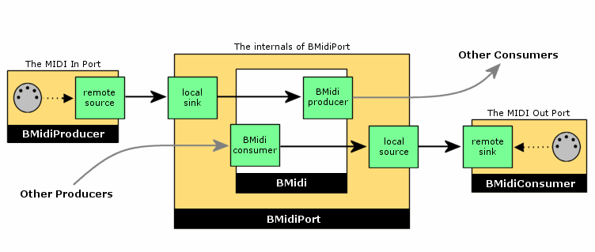

How libmidi1 works
~~~~~~~~~~~~~~~~~~

Midi1 is implemented on top of midi2, which means that libmidi.so
depends on libmidi2.so to do the real work. BeOS versions earlier than
R5 did not include a midi_server, because midi1 itself did not need it.
(A server is only really useful if data must be shared between teams,
something that midi1 did not allow.)

Midi2 is backwards compatible with midi1: The old libmidi.so still
exists so that applications using the old API will run (providing binary
compatibility). The old ``BMidiPort`` object is now a wrapper that uses
the new ``BMidiRoster`` to allow connections to any published MIDI
producer or consumer. Published MIDI objects are presented to the old
MIDI apps as if they were physical MIDI ports.

Here is a very nice picture of how ``BMidiPort`` works:

|image0|

The softsynth
~~~~~~~~~~~~~

The General MIDI synthesizer is implemented in ``BSoftSynth``. This is a
private class (not usable outside the API). It is not a real
``BMidiEndpoint``, so you will not see it appear on Patchbay. I did this
for simplicity's sake, for backwards compatibility (this is how the R5
synth worked too), and because we will have to give the Midi Kit a
complete makeover for R2 anyway.

The ``BMidiSynth`` and ``BSynth`` classes delegate most of the work to
``BSoftSynth``. Not all of their methods are implemented, since some of
them are very obscure. It would be a lot of work to figure out what they
do, while it is likely that no applications use them anyway. However,
``BMidiSynth`` and ``BSynth`` should perform most common tasks without
problems.

``BSamples`` doesn't do anything; its functions are mostly empty. In
other words, with the OpenBeOS Midi Kit you cannot push waveform data
into the output of the softsynth.

For simplicity's sake, ``BMidiSynthFile`` is implemented using
``BMidiStore``, since the latter already knows how to parse Standard
MIDI Files. Duplicating that functionality elsewhere would be pointless.
However, this makes the behavior of our ``BMidiSynthFile`` a little
different from what the BeBook says — as long as your applications are
written properly, you shouldn't notice any differences.

