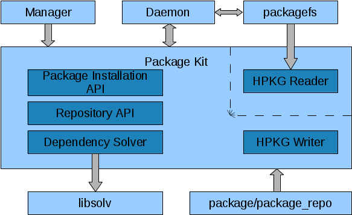

=================================
Package Management Infrastructure
=================================
This pages gives an overview of what components belong to Haiku's package
management infrastructure and how they work and interact.

- **package** and **package_repo** are command line tools for building package
  and package repository files. They are discussed in `Building Packages`_.
- **packagefs** is the file system that virtually extracts activated packages.
- The **package kit** is an API for package management related programming.
- The **dependency solver** is a part of the package kit. It solves dependencies
  between packages.
- The **package management daemon** (short: package daemon) is a background
  process that is activated whenever the user adds packages to or removes them
  from one of their activation locations. It verifies that all dependencies are
  fulfilled (prompting the user, if necessary) and performs whatever package
  pre-activation/post-deactivation tasks are required. The daemon is also
  contacted by the package manager (after it has resolved dependencies and
  downloaded all required packages) to do the package de-/activation.
- The **package manager** provides the user interface for software installation,
  update, and removal. There are actually two programs, ``pkgman``, a command
  line tool, and, ``HaikuDepot``, a GUI application.

.. _Building Packages: BuildingPackages.rst

Software Installation Locations
===============================
In Haiku there are two main locations where software is installed.
"/boot/system" and "/boot/home/config". "/boot/system" is where system-wide
software (i.e. software for all users), including the base system, is installed,
while "/boot/home/config" is only for the user's software. The discrimination
between those two doesn't make that much sense yet, but when Haiku supports
multi-user it will (obviously each user will need their own home directory then,
e.g. "/boot/home/<user>").

At both main installation locations a packagefs instance is mounted. Each
instance presents a virtually extracted union of the contents of all packages in
the subdirectory "packages" of that location. E.g. if one would extract the
contents of all package files in "/boot/system/packages" to an actual directory,
that would match exactly what is presented by packagefs in "/boot/system". With
a few exceptions -- packagefs provides several additional directories.

There are so-called shine-through directories which live on the underlying BFS
volume. Normally a file system mounted at a directory would completely hide
anything that is in that directory. These shine-through directories are handled
specially, though; packagefs shows them just like they are on the BFS volume.
One of those directories is "packages". This is necessary since otherwise it
wouldn't be possible to add, remove, or update any packages. Further
shine-through directories are "settings", "cache", "var", and "non-packaged".
The latter is a place where software can be installed the "traditional",
i.e. unpackaged, way.

Software Installation
=====================
Manual Installation
-------------------
At the lowest level software can be installed by simply dropping a respective
package file in a "packages" subdirectory of one of "/boot/system" or
"/boot/home/config". The package daemon, a background process that sleeps most
of the time, monitors the directory and, when happy with the newly added
package, it asks packagefs to presents its contents on the fly in the directory
structure. The package is said to be activated. Removing a package has the
opposite effect.

Things are a bit more complicated due to the fact that packages usually have
dependencies. E.g. when adding a package that has an unsatisfied dependency
(e.g. needs a certain library that is not installed) it is not a good idea to
activate the package nonetheless. The package contents (programs, libraries,...)
might not work correctly, and, e.g. when shadowing other installed software,
might even break things that worked before.

That's why the package daemon doesn't just activate any well-formed packages.
Instead it examines the new situation and checks whether all dependencies are
fulfilled and whether there are any conflicts. If they aren't any problems, it
tells packagefs to activate/deactivate the packages as requested. In case there
are issues with the dependencies, according to how it has been configured via
settings, the daemon prompts the user immediately, checks remote repositories
for solutions to the problem and presents the user with the possible options, or
it even performs all necessary actions without bothering the user, if possible.
In the end, if the problems could be solved (e.g. by downloading additional
packages), the respective packages will be de-/activated, or, otherwise, nothing
will be changed.

To avoid always having to check all dependencies when booting, the package
daemon writes the last consistent state of package activations to the file
"packages/administrative/activated-packages". When being mounted packagefs,
reads that file and only activates the packages specified by it. If the file is
missing or packages it refers to cannot be found or loaded, packagefs falls back
to activating all packages in the "packages" directory. The package daemon, once
started, checks the state.

Installation via Package Manager
--------------------------------
While manual software installation is possible, the more comfortable way is to
use the package manager. The package manager has a configurable list of remote
software repositories. It knows what software is available in those repositories
and what is installed locally. After the user has selected software packages to
be installed/deinstalled, package dependencies are resolved, and packages are
downloaded and moved to their installation location.

The package manager prepares a transaction directory, a subdirectory in the
"packages/administrative" directory, which contains the new packages. It then
contacts the package management daemon (via the package kit) to perform the
package activation changes. The daemon moves the new packages to the "packages"
directory, moves obsolete packages to an old state directory (also a
subdirectory in the "packages/administrative" directory, with the current
date and time encoded in its name) and asks packagefs to activate/deactivate the
respective packages. The old state directories allow recovery of old states.
That is particularly interesting for the system installation location. As as
safe mode/recovery option, the boot loader offers the user to select an old
installation state which can then be booted into, instead of the latest state.

Application Bundles
-------------------
Haiku also supports a concept that is commonly referred to as application
bundles. An application bundle is a fully self-contained package that doesn't
need to be installed anywhere. The implementation details have not yet been
decided on. The basic idea is to either mount a dedicated packagefs with the
content of such a package or have a special location where one of the three
already mounted packagefs instances (likely the "/boot/home/config" one) shows
that content. With a bit of Tracker (or even libbe) integration that will allow
the mounted directory to be opened or the application to be started when such a
package file has been double-clicked.

Installation Location Order and Consistency
-------------------------------------------
Having two separate installation locations for software requires some
considerations regarding their consistency and interactions. There's a
well-defined order of the installation locations: "/boot/home/config",
"/boot/system". This has already been the order in which on BeOS commands,
libraries, and add-ons where searched (according to the environmental variables
``PATH``, ``LIBRARY_PATH``, and ``ADDON_PATH``). That e.g. allows a user to
install a new/different version of a program in "/boot/home/config" and have it
override the version in "/boot/system".

This order also needs to be the order in which package dependencies are
directed. While it shall be possible to have a library in "/boot/home/config"
override one in "/boot/system" and have programs installed in the latter
location use the overriding library, packages in an installation location must
not have dependencies that can only be resolved to packages installed in a
location that is prior according to the order. E.g. a program installed in
"/boot/system" must not depend on a library that is only installed in
"/boot/home/config". When going multi-user that would mean the program would
work for one user, but not for another one who hasn't installed the library.
Consequently "/boot/system" is fully self-contained. All dependencies must be
resolved within it. A safe-mode boot should be possible with only the
"/boot/system" packagefs being mounted. As a consequence these constraints have
to be respected when software is installed or uninstalled.

Another challenge that comes with having two installation locations is that some
packages have compiled-in absolute paths to their own files (e.g. data files) or
to their dependencies. The former could be solved by building two different
versions of a package, but that wouldn't work with the latter and would be
tedious anyway. The solution are dynamically generated symbolic links in a fixed
location, "/boot/system/package-links" (symlinked to "/packages"), that for each
installed package and its dependencies refer to the respective installation
location.

For each installed package a subdirectory named like the package (package name
plus version) will be generated automatically. That subdirectory contains a
symlink ".self" which refers to the installation location of the package itself
as well as a symlink for each of its dependencies pointing to their installation
locations. Furthermore there's a symlink ".settings" which points to the
installation location's directory for global settings. E.g. for an OpenSSH
package installed in "/boot/home/config" and OpenSSL installed in "/boot/system"
the directory could look like this::

  /boot/system/package-links/openssh-5.8p2-1/
  	.self		-> ../../../home/config
  	.settings	-> ../../../home/config/settings/global
  	haiku		-> ../..
  	lib:libssl	-> ../..

Installing a different, compatible version of OpenSSL in "/boot/home/config"
would automatically change the respective dependency symlink. Once supporting
multi-user fully, the symlinks targets would also depend on the user ID of the
process that checks them, so software installed only for the user is handled
correctly.

While it depends on the location the package has been installed in where the
paths refer to, the absolute paths of the package links themselves remain
stable. So they can be compiled in, when a package is built, and will work
regardless of where the package is installed.

Another problem the package links can solve are incompatible versions of the
same package being installed in different locations. E.g. when a program and
another program it depends on are installed in "/boot/system", installing an
incompatible version of the latter in "/boot/home/config" will not break the
former, since the dependency link will continue to point to the compatible
version. With a bit of help from the runtime loader the same would work for
libraries. In practice that's less of a problem, though, since libraries usually
have a naming scheme and matching shared object names that already prevent
mismatches.

Software Repositories
=====================
A software repository is a collection of packages, usually accessible via the
internet. Haiku's package management solution allows to refer to any number of
software repositories from which packages can be downloaded and installed. The
structure of the respository is very simple. It's just a set of files which can
be downloaded via a common protocol (HTTP or FTP). One file is the repository
index file in `HPKR format`_. It lists all packages that are available in the
repository together with their descriptions and dependency information. It is
downloaded and cached, allowing user interfaces to show the information and the
dependency solver to do the computation locally. The other files are the
individual package files.

.. _HPKR format: FileFormat.rst#haiku-package-repository-format

Standard Repositories
---------------------
There are two standard repositories for Haiku:

- the Haiku repository, which only contains the small set of packages that is
  built by Haiku's build system (haiku.hpkg, haiku_devel.hpkg, etc.) and
- the HaikuPorts repository, which contains the packages maintained by
  HaikuPorts.

For the different builds and releases there are different instances of those two
repositories:

- There are snapshot repository instances for any repository version that was
  ever available (to save space old versions may be removed/thinned out). Those
  repositories will never be updated. Their main purpose is to be able to
  retrospectively get a certain Haiku version for testing and comparisons.
- For each official major release there will be an instance of the two
  repositories. For small updates the repositories will simply be updated. An
  official Haiku release is pre-configured with the corresponding repositories,
  so that the user can conveniently keep their Haiku up-to-date. The update to
  the next major release has to be requested explicitly.
- Similar to the nightly images there are repository instances that are
  continuously updated to the latest head of development. Those are suitable
  mainly for testers and developers.
- For each state of the HaikuPorts repository a Haiku development revision
  refers to a snapshot version of the repository is created. This allows to
  check out and build older Haiku revisions with their corresponding HaikuPorts
  packages.

The repositories are maintained via files in the Haiku git repository. For each
architecture and each repository the Haiku git repository contains a file
listing the packages for that repository. For the HaikuPorts repositories the
packages are listed with the respective version. For the Haiku repositories the
version is implied.

Whenever a developer wants to update or add a HaikuPorts package, the new
package file has to be uploaded to their git.haiku-os.org account and the
package list file for the repository has to be adjusted accordingly.
``jam upload-packages <packages-list>`` can be used in order to upload the
package(s) or the packages could just be ``scp``'ed into the 'hpkg-upload'
folder in the developer home directory on git.haiku-os.org. When that is done,
the change can be pushed to git.haiku-os.org, where a push hook will analyze the
change, move the new package file(s) from the developer's account to the
repository directory, and build a new repository snapshot. If a package file is
missing or broken, the push will be rejected with a message notifying the
developer about the problem.

The creation and update of repositories for official releases has to be
triggered explicitly on the server. In either case the Haiku repository is built
by the build service.

The Package Kit
===============
The package kit provides an API for all package management related tasks,
including:

- Reading and writing HPKG and HPKR files.
- Adding, removing, and querying software repositories.
- Solving package dependencies.
- Adding, removing, and updating packages.

Localization
============
Package files and repository index files contain text strings -- e.g. the
package short and long description -- that are presented to the user. Therefore
translations for these strings must be available. Since it is impractical to
include the translations in the package and repository index files, they must be
provided in separate files. How exactly has not been decided on yet.
